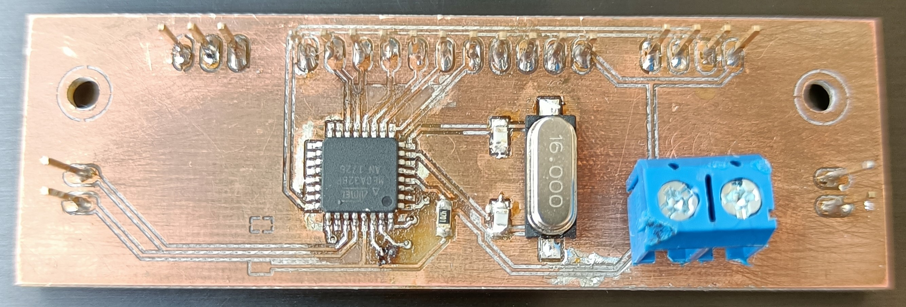

# Smart Systems

Sten Hulsbergen 
2ITIOT 

# Portfolio

## Korte beschrijving van het project

Het project is het ontwerpen van een smart car. De PCB's worden individueel gemaakt en de auto moet automatisch alsook manueel bestuurbaar kunnen zijn met embedded software.

### Wat is het doel van het project?

Het doel is om een analyse te maken en met deze analyse het project op te bouwen. Dit houdt in dat er PCB's ontworpen moesten worden, gemaakt en bestukt. Later dan software ontwikkelen en de wagen testen.

### Wat is er gerealiseerd?

- Analyse gemaakt
- PCB’s ontwropen
- PCB’s gefreesd
- PCB’s bestukt
- Software geschreven
- Wagen getest

## Toelichten van het finale ontwerp van het project:
### Wat waren de vereisten van het project?

De auto moest twee UART connectoren bevatten, drie I2C connectoren, de regelaar 7805 vervangen door een LDL1117 van 3.3V en 5V, polariteitsbeveiliging voorzien, motordriver aanpassen naar een SMD-type en een OLED-scherm met I2C sturing. Naast de sturing moesten een aantal sensoren voorzien worden, een linetracker, IR- en ultrasone afstandssensoren. Ook zullen er verkeerssignalisaties ontwikkeld moeten worden zoals verkeerslichten, slagbomen,... Als laatste moet de wagen manueel alsook automatisch bestuurd kunnen worden en een patroon kunnen rijden.

### Effectieve ontwerpen:
#### PCB Design
##### Sturingschakeling

##### Sensorschakeling

### Extra documentatie van de software 
De software is grotendeel opgebouwd uit enum's en switches. Dit maakt het makkelijk om duidelijke code te schrijven zonder dat deze moeilijk te lezen is door een andere persoon. De ESP32 maakt verbinding met het internet en dan de MQTT broker. Vervolgens initialiseerd de software allerlei nodige onderdelen zoals de serial monitor, etc in de setup. In de loop wordt steeds gekeken of de keuze in het menu op automatisch staat of op manueel. Als deze op automatisch staat, dan gebruikt de auto de linetracker en stuurd hij bepaalde commando's zoals links, rechts, voorwaards, etc. Als er gekozen was voor manueel, dan worden de waardes gebruikt die van de Node-RED besturing komen. Dit zijn knoppen om de gewenste richting ingeven. Om te wissel van modus kan dat via het dropdownmenu.

#### Node-RED besturing

### Node-RED

### Flowchart

### Flowchart manuele besturing

### Testen en resultaten 

De tests zijn niet gedaan met de eigen ontworpen PCB's maar met de oude. Dit was nodig om de software toch een kans te kunnen geven en daar aan te kunnen werken. Deze software bevat een Node-RED en hiermee kan de auto succesvol automatisch rijden en manueel bestuurd worden. Er mist een deel van de software omdat de rest van de sensoren niet getest konden worden omdat er ook te weinig tijd was. Hiervan is een demo gemaakt om te laten zien tijdens de presentatie.

### Conclusie

Ik heb geleerd dat een analyse zeer belangrijk is in een project aangezien dit de basis is voor een project. Door op een goede manier alle componenten op te zoeken en de gegevens er van overnemen kan veel tijd bespaard worden later. In het begin moesten we allemaal apart werken aan ons project, later is gebleken dat dat niet echt kon en hielp iedereen elkaar als het kon. Het ontwerpen van de PCB's was niet makkelijk, zeker ook omdat het voelde alsof het uit het niks kwam. Door materiaaltekort en tijdsgebrek is het project niet helemaal afgeraakt. Ik heb geprobeerd om de ontworpen PCB's zo goed mogelijk te ontwerpen al waren er een aantal onderdelen zo goed als niet te doen zoals de USB-C connector. De software is niet ontworpen voor deze schakelingen maar werkt wel op de oude PCB. Op deze manier is er toch nog een rijdende auto voorzien.

### Wat ik heb geleerd

- Fusion360
- PCB frezen
- Werken met de reflow oven
- Solderen
- Werken met ESP32
- Node-RED

### Verbeteringen 

Het aantal vias kan verminderd worden. Voor de pinnen die alleen langs de onderkant gesoldeerd kunnen worden de paden langs onder laten lopen.

Code ontbreekt voor de IR- en ultrasone sensor, alleen de ESP32 wordt gebruikt.
